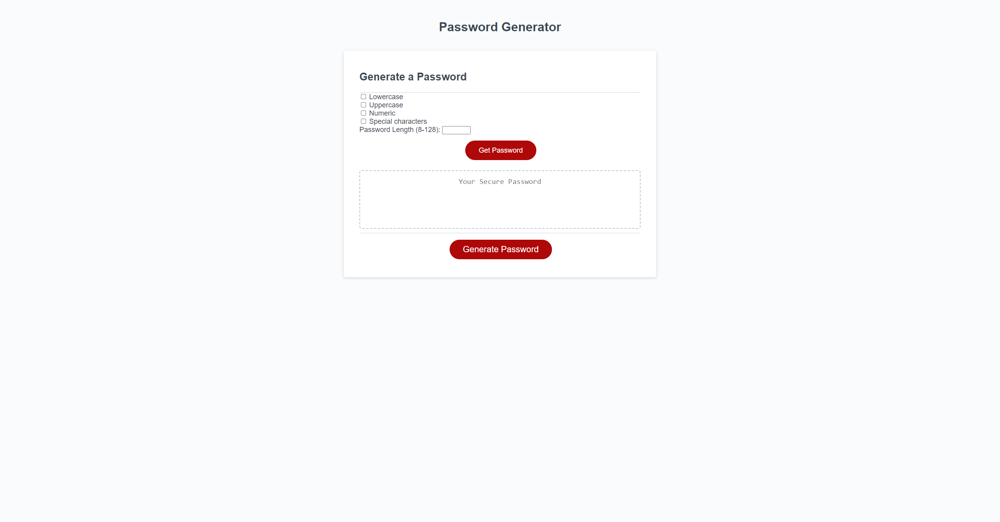

# Nick's Password Generator Application

This is a simple password generator application that allows you to generate secure passwords based on selected criteria. You can specify the length of the password and choose from lowercase letters, uppercase letters, numeric characters, and special characters. The generated password is displayed in a text area for easy copying.

[Application link](https://nickucla.github.io/Nicks-Password-Generator/)

## How to Use

1. Open the application in a web browser.
2. Select the desired password criteria by checking the corresponding checkboxes.
3. Enter the desired password length (between 8 and 128 characters) in the provided input field.
4. Click the "Get Password" button.
5. A password meeting the specified criteria and length will be displayed in the text area below.
6. To generate a new password with different criteria, repeat steps 2 to 5.

## Implementation Details

The password generator application is built using HTML, CSS, and JavaScript. The JavaScript code performs the following steps:

1. Retrieves the selected password criteria (checkboxes) and the specified password length from the user interface.
2. Validates the password length to ensure it falls within the acceptable range.
3. Constructs a string containing all possible characters based on the selected criteria.
4. Generates a random password by iterating over the selected criteria and appending a random character from the corresponding character set in each iteration.
5. Returns the generated password.

## File Structure

The application consists of the following files:

- `index.html`: The main HTML file that contains the structure and layout of the application.
- `style.css`: The CSS file that defines the styles and appearance of the application.
- `script.js`: The JavaScript file that handles the logic and functionality of the password generator.

## Usage

To use the password generator application, simply open the `index.html` file in a web browser that supports JavaScript.

## Notes

- Please ensure that you select at least one criteria and enter a valid password length (between 8 and 128 characters) before generating a password.
- The generated passwords are intended to be secure and random. However, always exercise caution and follow best practices for password management and security.
